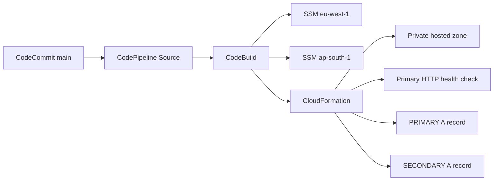

# Route 53 Private DNS Failover with CodeBuild

This task deploys a private Route 53 hosted zone with primary/secondary DNS
failover through a native AWS CI/CD pipeline.

The deployment runs in `eu-west-1`. It reads the secondary endpoint parameter
from `ap-south-1` because the secondary application is hosted there.

## What Is Being Built



The private hosted zone is associated with the primary VPC. The application DNS
record is configured twice: a `PRIMARY` record points at the primary endpoint
and has a Route 53 HTTP health check; a `SECONDARY` record points at the standby
endpoint. Route 53 answers with the primary record while its health check is
healthy and changes to the secondary record when it is unhealthy.

## AWS Resources

| Resource | Name | Responsibility |
| --- | --- | --- |
| CodeCommit | `cmtr-msdta2zd-repo` | Holds `template.yml` and `buildspec.yml` on `main` |
| CodeBuild | `cmtr-msdta2zd-codebuild` | Reads parameters and deploys CloudFormation |
| CodeBuild role | `cmtr-msdta2zd-codebuild-role` | Least-privilege runtime access for the build |
| CodePipeline | `cmtr-msdta2zd-pipeline` | Starts CodeBuild on a `main` commit |
| CloudFormation stack | `cmtr-msdta2zd-r53-stack` | Owns Route 53 resources |
| Private hosted zone | Created by the stack | Resolves the internal application record |
| Health check | Created by the stack | Checks HTTP on the primary public IP |

The pipeline also uses a private S3 artifact bucket and a dedicated
`cmtr-msdta2zd-codepipeline-role`.

## Input Parameters

The build never hard-codes environment IP addresses. `buildspec.yml` loads
these values at build time:

| Parameter | Region | Meaning |
| --- | --- | --- |
| `/cmtr-msdta2zd/zone_name` | `eu-west-1` | Private hosted zone name |
| `/cmtr-msdta2zd/app_name` | `eu-west-1` | Fully qualified failover record name |
| `/cmtr-msdta2zd/ec2_ip_primary` | `eu-west-1` | Primary web server public IP |
| `/cmtr-msdta2zd/ec2_ip_secondary` | `ap-south-1` | Secondary web server public IP |

It also finds `cmtr-msdta2zd-vpc-primary` by its `Name` tag, then passes the
VPC ID and SSM values to `aws cloudformation deploy`.

## Scripts and Order

Run the scripts in numeric order. Every script is idempotent: a re-run checks
for existing resources and creates or updates only what is missing or changed.

| Script | Objective | What it does |
| --- | --- | --- |
| `01-create-codecommit-repository.ps1` | Source repository | Creates and verifies CodeCommit repository |
| `02-create-cloudformation-template.ps1` | Infrastructure template | Generates `source/template.yml` |
| `03-create-buildspec.ps1` | Build orchestration | Generates `source/buildspec.yml` |
| `04-push-codecommit-source.ps1` | Source upload | Commits both source files to CodeCommit `main` |
| `05-create-codebuild-project.ps1` | Build security | Creates/updates CodeBuild role and project |
| `06-create-codepipeline.ps1` | CI/CD | Creates/updates artifact bucket, pipeline role, and pipeline |
| `07-run-pipeline-and-verify.ps1` | Deployment | Starts a pipeline execution and verifies completed resources |

Example:

```powershell
powershell -ExecutionPolicy Bypass -File .\07-run-pipeline-and-verify.ps1
```

Temporary AWS credentials are intentionally not stored in any script or source
file. Set them only in the local terminal session before running a script.

## Pipeline Flow

1. A commit reaches CodeCommit branch `main`.
2. CodePipeline packages the source as an artifact.
3. CodeBuild downloads the artifact from the pipeline S3 bucket.
4. CodeBuild reads SSM parameters and discovers the primary VPC.
5. CodeBuild runs `aws cloudformation deploy`.
6. CloudFormation creates or updates the private zone, health check, and both
   failover record sets.

CodePipeline uses polling for CodeCommit branch changes. A new commit to `main`
therefore creates a new pipeline execution automatically.

## Verification Checklist

Only press the challenge **Verify** button after all checks below are complete.

```powershell
aws codepipeline get-pipeline-state `
  --name cmtr-msdta2zd-pipeline `
  --region eu-west-1

aws cloudformation describe-stacks `
  --stack-name cmtr-msdta2zd-r53-stack `
  --region eu-west-1 `
  --query "Stacks[0].StackStatus" `
  --output text
```

Expected results:

- CodePipeline `Source` and `Build` actions show `Succeeded`.
- CloudFormation stack is `CREATE_COMPLETE` on the first deployment, or
  `UPDATE_COMPLETE` on a later deployment.
- The stack has `HostedZoneId` and `ApplicationRecordName` outputs.
- Route 53 has two A records for the application name: `PRIMARY` and
  `SECONDARY`.
- The `PRIMARY` record includes a health check ID.

To verify DNS inside the private network, use the pre-created test instance
through Session Manager:

```bash
dig +short app.cmtr-msdta2zd.internal
```

The expected answer is the primary endpoint IP while the health check is
healthy.

## Troubleshooting

### Pipeline or build is still in progress

Do not press challenge Verify during `InProgress` or `CREATE_IN_PROGRESS`.
Wait until the pipeline Build stage succeeds and CloudFormation reaches a
complete status, then run `07-run-pipeline-and-verify.ps1` again.

### CodeBuild cannot download source

The CodeBuild role needs `s3:GetObject` and `s3:GetObjectVersion` for the exact
CodePipeline artifact bucket. This task uses a custom bucket named
`cmtr-msdta2zd-pipeline-artifacts-<account-id>`, not the AWS default
`codepipeline-<region>-<account-id>` bucket.

### CodeCommit upload says ParentCommitIdRequired

The first `put-file` creates the branch. Every following file commit must use
the latest branch commit ID as `--parent-commit-id`. Script 04 does this
automatically and treats unchanged files as successful no-ops.

### CloudFormation deploy fails before creating a stack

`aws cloudformation deploy` works with change sets. The CodeBuild role needs
`CreateChangeSet`, `DescribeChangeSet`, `ExecuteChangeSet`, and
`DeleteChangeSet` in addition to ordinary stack read/create/update actions.

### Route 53 record deployment reaches `ROLLBACK_FAILED`

CloudFormation creates and removes Route 53 record sets on behalf of the
CodeBuild role. It first reads the hosted zone, so the role also needs
`route53:GetHostedZone` alongside `ChangeResourceRecordSets`. Without that
permission, `PrimaryRecord` and `SecondaryRecord` fail with `AccessDenied`.

CloudFormation then attempts to undo the failed deployment. If the same
permission is still missing, it cannot delete the failed record resources and
the stack ends in `ROLLBACK_FAILED`. This is not a DNS failover event: it is a
deployment rollback, meaning CloudFormation is returning AWS resources to the
state before the attempted release.

Recovery used for this task:

1. Read the exact failure before changing resources:

  ```powershell
  aws cloudformation describe-stack-events `
    --stack-name cmtr-msdta2zd-r53-stack `
    --region eu-west-1
  ```

2. Add the missing `route53:GetHostedZone` action to the CodeBuild inline
  policy in `05-create-codebuild-project.ps1`, then rerun that script.
3. Delete the failed stack only after the corrected role policy is applied:

  ```powershell
  aws cloudformation delete-stack `
    --stack-name cmtr-msdta2zd-r53-stack `
    --region eu-west-1

  aws cloudformation wait stack-delete-complete `
    --stack-name cmtr-msdta2zd-r53-stack `
    --region eu-west-1
  ```

4. Start a new pipeline execution with
  `07-run-pipeline-and-verify.ps1` and wait for `Succeeded` before running
  the challenge verifier.

The role policy is intentionally applied through the script rather than
manually in the AWS Console. Future reruns keep the required permission and
make the repair reproducible.