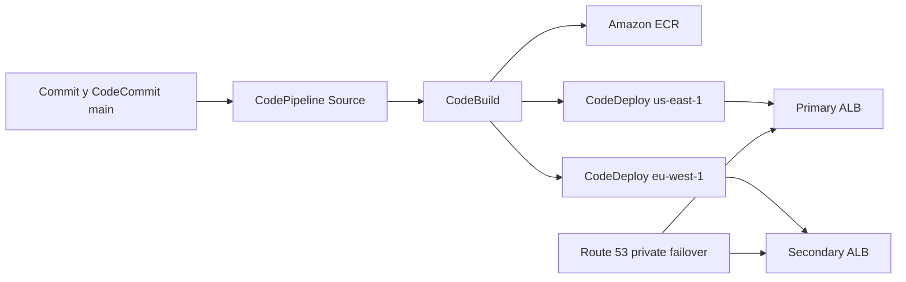

# Blue/Green Multi-Region CI/CD

## Що побудовано

Автоматизований CI/CD для контейнерного Python-застосунку у двох AWS-регіонах:

- primary: `us-east-1`;
- secondary: `eu-west-1`;
- контейнерний registry: Amazon ECR `cmtr-msdta2zd-north-pole`;
- source repository: CodeCommit `cmtr-msdta2zd-repo`;
- pipeline: CodePipeline `cmtr-msdta2zd-cicd-pipeline`;
- build: CodeBuild `cmtr-msdta2zd-docker-build`;
- deployments: CodeDeploy blue/green у кожному регіоні;
- failover DNS: приватна Route 53 zone `cmtr-msdta2zd-zone`.

## Навіщо це потрібно

Рішення доставляє нову версію застосунку без простою та з регіональним резервуванням:

- новий контейнер збирається один раз і зберігається в ECR;
- у кожному регіоні нова версія розгортається на окремому green fleet;
- трафік перемикається тільки після успішного запуску та health checks green instances;
- якщо primary ALB недоступний, Route 53 повертає secondary ALB.

## Як працює pipeline



1. Commit у `main` запускає EventBridge rule і CodePipeline.
2. Source stage отримує код із CodeCommit.
3. CodeBuild збирає Docker image, додає теги `latest` та commit SHA, пушить image в ECR.
4. Pipeline передає deployment artifact з `appspec.yml`, `image-uri.txt` і lifecycle scripts у дві паралельні CodeDeploy actions.
5. CodeDeploy копіює blue Auto Scaling Group у green fleet, виконує hooks, перевіряє ALB health checks і перемикає трафік.
6. Після успішного traffic shift старий blue fleet завершується. Green fleet стає робочим fleet для наступної deployment.

## Deployment hooks

| Hook | Призначення |
| --- | --- |
| `stop_container.sh` | Зупиняє та видаляє попередній контейнер. |
| `after_install.sh` | Логіниться в ECR і завантажує image із `image-uri.txt`. |
| `start_container.sh` | Запускає контейнер `cmtr-msdta2zd-north-pole` на порту `8080`. |

Застосунок має endpoints:

- `/` повертає application, region та instance ID;
- `/health` повертає health status для ALB.

## Регіональний failover

Private hosted zone містить два alias A records для `app.cmtr-msdta2zd-zone`:

| Роль | Регіон | ALB | DNS routing |
| --- | --- | --- | --- |
| Primary | `us-east-1` | `cmtr-msdta2zd-alb-us-east-1` | Route 53 `PRIMARY` з health check |
| Secondary | `eu-west-1` | `cmtr-msdta2zd-alb-eu-west-1` | Route 53 `SECONDARY` з health check |

Кожен record має власний Route 53 health check. Коли primary health check стає unhealthy, Route 53 відповідає secondary alias record.

## Ресурси

| Категорія | Ресурси |
| --- | --- |
| Artifact storage | `cmtr-msdta2zd-artifacts-us-east-1`, `cmtr-msdta2zd-artifacts-eu-west-1`; versioning enabled |
| IAM | `cmtr-msdta2zd-codebuild-role`, `cmtr-msdta2zd-codedeploy-role`, `cmtr-msdta2zd-pipeline-role` |
| CodeDeploy | `cmtr-msdta2zd-app-us-east-1` / `cmtr-msdta2zd-dg-us-east-1`; `cmtr-msdta2zd-app-eu-west-1` / `cmtr-msdta2zd-dg-eu-west-1` |
| Route 53 | Private hosted zone `Z0099418DRYZ4ACAI1VW` and two failover records |
| Trigger | EventBridge rule `cmtr-msdta2zd-source-trigger` |

## Скрипти

| Скрипт | Що робить |
| --- | --- |
| `00-discover-prerequisites.ps1` | Перевіряє pre-deployed VPC, ALB, ASG, CodeCommit і test instance. |
| `01-prepare-and-push-source.ps1` | Готує та завантажує source, buildspec, appspec і hooks до CodeCommit. |
| `02-provision-multi-region-cicd.ps1` | Створює або оновлює ECR, buckets, IAM, CodeBuild, CodeDeploy, CodePipeline, EventBridge і Route 53. Перед deployment відновлює blue fleets до двох `InService` instances. |
| `03-run-pipeline-and-verify.ps1` | Запускає новий pipeline execution і виконує перевірки. Не запускати його, якщо потрібно лише перевірити поточний execution. |
| `04-cleanup-stale-asgs.ps1` | Після повторних blue/green запусків залишає по одній найновішій ASG, прив'язаній до application target group, у кожному регіоні. |

## Підтверджений результат

Pipeline execution `a33aaeec-cd2d-4ca7-968d-f7384d30ec70` завершився успішно:

- Source: `Succeeded`;
- Build: `Succeeded`;
- DeployRegion1: deployment `d-DWJORG4UL` succeeded;
- DeployRegion2: deployment `d-VXKH3NWKL` succeeded.

ECR містить `latest` і image з commit-SHA `681c128b4e97374a7917f29c2636968c51d2ddae`. Обидва failover records у Route 53 створені з health check IDs.

## Ручна перевірка без нового pipeline

```powershell
aws codepipeline get-pipeline-state `
  --name cmtr-msdta2zd-cicd-pipeline `
  --region us-east-1

aws ecr list-images `
  --repository-name cmtr-msdta2zd-north-pole `
  --region us-east-1

aws route53 list-resource-record-sets `
  --hosted-zone-id Z0099418DRYZ4ACAI1VW
```

Для перевірки private DNS із test instance використовується SSM:

```bash
dig app.cmtr-msdta2zd-zone
curl -s http://app.cmtr-msdta2zd-zone/
```

AWS credentials не зберігаються в scripts або repository. Вони мають існувати тільки у поточному shell session.
