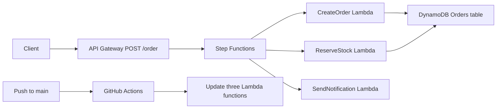

# Serverless CI/CD for Event-Driven Architectures

## Мета

У проєкті реалізовано serverless обробку замовлення в AWS та CI/CD для оновлення Lambda functions через GitHub Actions.

Після push у `main` GitHub Actions:

1. бере код трьох Lambda з `lambdas/`;
2. створює окремий ZIP для кожної function;
3. виконує `aws lambda update-function-code --publish`;
4. AWS публікує нову версію функції.

## Архітектура



## Компоненти

| Компонент | Ім'я | Призначення |
| --- | --- | --- |
| API Gateway | `cmtr-msdta2zd-OrdersAPI` | Приймає `POST /order` і запускає Step Functions. |
| Step Functions | `cmtr-msdta2zd-state-machine` | Оркеструє послідовність обробки замовлення. |
| Lambda | `cmtr_msdta2zd_lambda_createOrder` | Створює запис замовлення у DynamoDB. |
| Lambda | `cmtr_msdta2zd_lambda_reserveStock` | Оновлює статус замовлення на `STOCK_RESERVED`. |
| Lambda | `cmtr_msdta2zd_lambda_sendNotification` | Виконує mock notification. |
| DynamoDB | `cmtr-msdta2zd-Orders-table` | Зберігає замовлення, ключ `orderId`. |
| GitHub Actions | `.github/workflows/deploy-serverless-orders.yml` | Пакує та деплоїть Lambda functions при push у `main`. |

## Step Functions workflow

State machine використовує інтеграцію `arn:aws:states:::lambda:invoke` і виконує tasks у такому порядку:

```text
CreateOrder -> ReserveStock -> SendNotification
```

Кожна task передає поточний payload через `"Payload.$": "$"`, а `OutputPath: "$.Payload"` передає результат попередньої Lambda наступній.

## Repository layout

```text
lambdas/
  cmtr_msdta2zd_lambda_createOrder/
    handler.py
  cmtr_msdta2zd_lambda_reserveStock/
    handler.py
  cmtr_msdta2zd_lambda_sendNotification/
    handler.py
.github/workflows/
  deploy-serverless-orders.yml
```

Lambda handler configuration очікує source folder всередині ZIP, наприклад:

```text
cmtr_msdta2zd_lambda_createOrder/handler.py
```

Тому workflow архівує папку function, а не лише `handler.py`.

## GitHub Secrets

У GitHub repository settings необхідні такі Actions secrets:

```text
AWS_REGION
AWS_ACCESS_KEY_ID
AWS_SECRET_ACCESS_KEY
AWS_SESSION_TOKEN
```

Для стабільного production CI/CD замість короткочасного sandbox token слід використовувати окремого IAM deploy user з мінімальними правами `lambda:UpdateFunctionCode` лише на ці три Lambda functions.

## Перевірки

Встановити регіон:

```powershell
$region = "eu-west-1"
```

### 1. Перевірка AWS identity

```powershell
aws sts get-caller-identity
```

### 2. Перевірка Lambda functions

```powershell
aws lambda get-function `
  --function-name cmtr_msdta2zd_lambda_createOrder `
  --region $region `
  --query "Configuration.{State:State,Handler:Handler,LastModified:LastModified}" `
  --output table

aws lambda get-function `
  --function-name cmtr_msdta2zd_lambda_reserveStock `
  --region $region `
  --query "Configuration.{State:State,Handler:Handler,LastModified:LastModified}" `
  --output table

aws lambda get-function `
  --function-name cmtr_msdta2zd_lambda_sendNotification `
  --region $region `
  --query "Configuration.{State:State,Handler:Handler,LastModified:LastModified}" `
  --output table
```

Очікувано: кожна function має `State = Active`.

### 3. Перевірка Step Functions definition

```powershell
aws stepfunctions describe-state-machine `
  --state-machine-arn "arn:aws:states:eu-west-1:783764619243:stateMachine:cmtr-msdta2zd-state-machine" `
  --region $region `
  --query "{Name:name,Definition:definition}" `
  --output json
```

Очікувано: `StartAt` дорівнює `CreateOrder`, а definition містить `ReserveStock`, `SendNotification` і `"Payload.$": "$"`.

### 4. Перевірка DynamoDB table

```powershell
aws dynamodb describe-table `
  --table-name cmtr-msdta2zd-Orders-table `
  --region $region `
  --query "Table.{Status:TableStatus,Items:ItemCount,KeySchema:KeySchema}" `
  --output json
```

Очікувано: `Status = ACTIVE`, partition key `orderId`.

### 5. End-to-end API test

```powershell
$verification = "verify-$([guid]::NewGuid().ToString('N'))"

curl.exe -i -X POST `
  "https://2m6np709bg.execute-api.eu-west-1.amazonaws.com/dev/order" `
  -H "Content-Type: application/json" `
  -d "{`"verification`":`"$verification`"}"
```

Очікувано: `HTTP/1.1 200 OK` і response з `executionArn`.

### 6. Перевірка конкретного execution

```powershell
aws stepfunctions describe-execution `
  --execution-arn "<executionArn from API response>" `
  --region $region `
  --output json
```

Очікувано: `status = SUCCEEDED`, а output містить `Notification sent`, `orderId` та переданий `verification` value.

### 7. Перевірка останніх executions

```powershell
aws stepfunctions list-executions `
  --state-machine-arn "arn:aws:states:eu-west-1:783764619243:stateMachine:cmtr-msdta2zd-state-machine" `
  --region $region `
  --max-results 3 `
  --output table
```

### 8. Перевірка GitHub Actions deployment

```powershell
gh run list --repo PVS-1/ci-cd-challenge --limit 5
```

Очікувано: latest run workflow `Deploy Serverless Order Processing` має status `completed` і conclusion `success`.

## Підтверджений результат

Успішний end-to-end execution:

```text
arn:aws:states:eu-west-1:783764619243:execution:cmtr-msdta2zd-state-machine:5e00ee84-c8e2-4fe6-8734-fe7109064a89
```

Результат:

```text
status: SUCCEEDED
message: Notification sent
```

API Gateway повернув `HTTP 200`, а state machine повернула `orderId` і той самий `verification` ID, який було передано у HTTP request.

## Security

Не зберігати AWS keys, session tokens або GitHub deploy/access token у source code чи git history. Token для lab verifier треба видалити після успішної перевірки.
