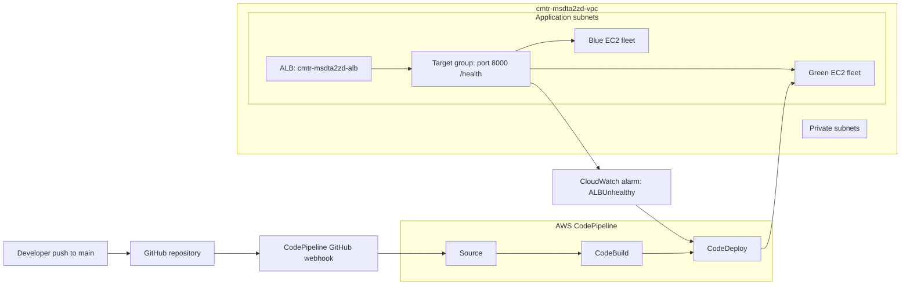

# Monitoring and Rollback with CloudWatch and CodeDeploy

## Overview

This implementation deploys the Flask application from the root of this repository to EC2 through a GitHub-triggered AWS pipeline in `eu-west-1`.



## Components

| Component | Name | Purpose |
| --- | --- | --- |
| Source | `PVS-1/ci-cd-challenge`, `main` | Stores the application and deployment files. |
| Pipeline | `cmtr-msdta2zd-codepipeline` | Orchestrates Source -> Build -> Deploy. |
| Build | `cmtr-msdta2zd-codebuild-project` | VPC-attached CodeBuild project that produces a CodeDeploy artifact. |
| Deploy | `cmtr-msdta2zd-codedeploy-application` | CodeDeploy EC2/on-premises application. |
| Deployment group | `cmtr-msdta2zd-codedeploy-deployment-group` | Blue/green deployment with ALB traffic control. |
| Load balancer | `cmtr-msdta2zd-alb` | Public HTTP endpoint. |
| Target group | `cmtr-msdta2zd-target-group` | Probes `/health` on port `8000`. |
| Monitoring | `ALBUnhealthy` | Monitors `AWS/ApplicationELB` metric `UnHealthyHostCount`. |

## Application and artifact

The deployable source is intentionally at the repository root because CodeBuild runs `buildspec.yml` from the root and CodeDeploy expects `appspec.yml` at the artifact root.

```text
app.py
requirements.txt
buildspec.yml
appspec.yml
scripts/
  install.sh
  start.sh
  stop.sh
```

`app.py` listens on `0.0.0.0:8000`, matching the pre-created target group. It serves:

- `/`: `Hello from the environment msdta2zd!`
- `/health`: HTTP 200 health response

`appspec.yml` installs the artifact at `/opt/cmtr-msdta2zd-app`.

- `install.sh` creates the virtual environment, installs Flask, and creates `cmtr-msdta2zd-app.service`.
- `start.sh` enables and starts the service.
- `stop.sh` safely stops the prior service.

## Monitoring and rollback

`ALBUnhealthy` has one 60-second evaluation period and enters `ALARM` when `UnHealthyHostCount >= 1`.

CodeDeploy alarm monitoring is enabled after the initial healthy release and automatic rollback is enabled for:

- `DEPLOYMENT_FAILURE`
- `DEPLOYMENT_STOP_ON_ALARM`
- `DEPLOYMENT_STOP_ON_REQUEST`

The initial release runs before alarm-gating is enabled because the pre-created baseline can begin unhealthy. Once the new green fleet passes the target group health check, the deployment group is updated with the final alarm-based rollback configuration.

## Verified Result

The fresh pipeline execution `3da652e8-f3de-48a9-90bb-f768895ab0b0` completed with `Source`, `Build`, and `Deploy` all `Succeeded`.

The CodeDeploy blue/green deployment `d-K3RAHL8LL` completed successfully. The green target passed `/health` on port `8000`, and the ALB returned:

```text
Hello from the environment msdta2zd!
```

## Verification

```powershell
$region = "eu-west-1"

aws codepipeline get-pipeline-state `
  --name cmtr-msdta2zd-codepipeline `
  --region $region

aws codebuild batch-get-projects `
  --names cmtr-msdta2zd-codebuild-project `
  --region $region

aws cloudwatch describe-alarms `
  --alarm-names ALBUnhealthy `
  --region $region

aws deploy get-deployment-group `
  --application-name cmtr-msdta2zd-codedeploy-application `
  --deployment-group-name cmtr-msdta2zd-codedeploy-deployment-group `
  --region $region

$dns = aws elbv2 describe-load-balancers `
  --names cmtr-msdta2zd-alb `
  --region $region `
  --query "LoadBalancers[0].DNSName" `
  --output text

Invoke-WebRequest "http://$dns/" -UseBasicParsing
```

No AWS credentials or GitHub tokens are stored in the repository.
